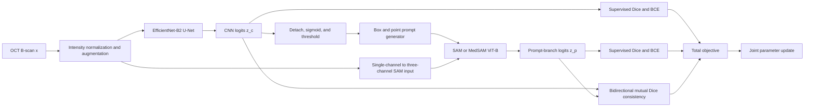
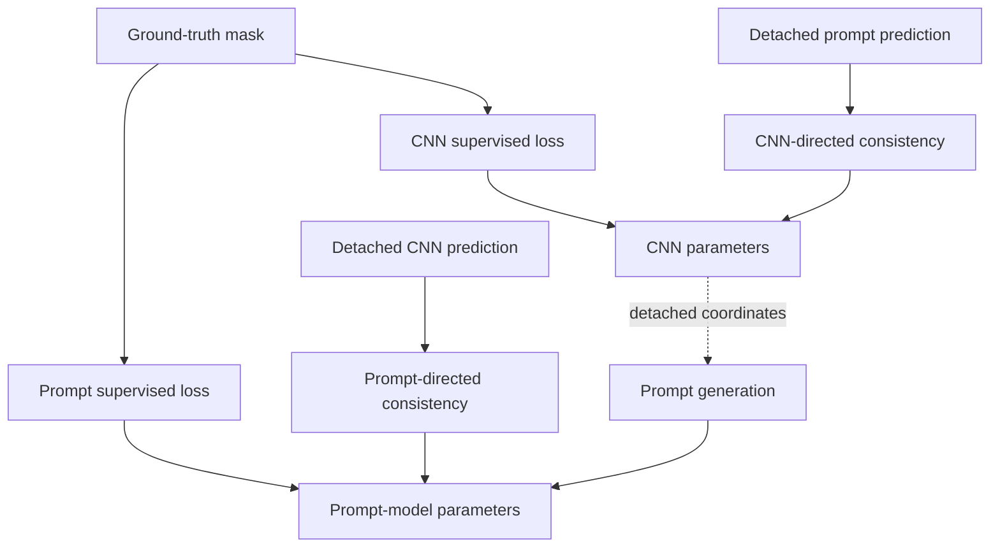

# SemiSAM Architecture

## Overview

SemiSAM is a dual-branch semi-supervised segmentation architecture for intraretinal cyst and fluid delineation in OCT B-scans. It combines a deployable convolutional model with a promptable foundation model during training. The two branches learn from labeled scans and regularize one another on both labeled and unlabeled scans. Only the convolutional branch is retained for inference.



## Input and Output Contract

For a batch of OCT B-scans, the training tensors follow this contract:

```text
images:        [B, 1, H, W] float32
labels:        [B, 1, H, W] binary
cnn_logits:    [B, 1, H, W]
prompt_logits: [B, 1, H, W]
boxes:         [B, 4]        in (x_min, y_min, x_max, y_max) format
points:        [B, 2]        in (x, y) format
point_labels:  [B]           1 for foreground, 0 for background
```

Each training batch contains `B_l` labeled samples and `B - B_l` unlabeled samples. The labeled samples occupy the first `B_l` positions so supervised losses can be applied by slicing the batch. Both groups participate in mutual consistency learning.

## Branch A: EfficientNet U-Net

The primary branch is a U-Net with an EfficientNet-B2 encoder. It receives a normalized single-channel B-scan and produces one foreground logit per pixel:

```text
z_c = f_cnn(x; theta_c)
p_c = sigmoid(z_c)
```

The encoder can be initialized with ImageNet weights. This branch is the final deployable model and is used independently at inference time.

Implementation: `code/networks/efficient_unet.py`

## CNN-Guided Prompt Construction

The prompt generator converts the CNN probability mask into spatial guidance for the promptable branch:

1. Detach `p_c` from the computation graph.
2. Threshold it at `tau` to obtain a binary foreground proposal.
3. Compute the tight bounding box around all foreground pixels.
4. Expand the box by a configurable margin and clip it to the image boundary.
5. Sample one positive point from the proposed foreground.

If the CNN predicts no foreground, the full image is used as the box and the image center is supplied as a negative point. Detachment deliberately prevents gradients from passing through the non-differentiable thresholding and coordinate extraction operations.

Implementation: `code/prompts/mask_prompts.py`

## Branch B: SAM or MedSAM

The promptable branch receives the same OCT image together with the generated box and point:

```text
z_p = f_prompt(x, box(p_c), point(p_c); theta_p)
p_p = sigmoid(z_p)
```

Before encoding, the OCT channel is repeated three times, resized to the SAM image-encoder resolution, and normalized by the SAM preprocessing routine. Prompt coordinates are scaled to the resized image. The mask decoder output is then upsampled to the original training resolution.

The SAM image encoder may be frozen while the prompt encoder and mask decoder remain trainable. This reduces memory and computation while preserving the prompt-guided learning signal.

Implementation: `code/networks/sam_adapter.py`

## Learning Objective

### Supervised Segmentation

Ground-truth supervision is applied only to the labeled subset. Each branch uses the sum of soft Dice loss and binary cross-entropy with logits:

```text
L_cnn_sup    = DiceBCE(z_c[0:B_l], y[0:B_l])
L_prompt_sup = DiceBCE(z_p[0:B_l], y[0:B_l])
L_sup        = 0.5 * (L_cnn_sup + L_prompt_sup)
```

### Mutual Consistency

All samples contribute to a bidirectional consistency objective:

```text
L_cnn<-prompt = Dice(z_c, stopgrad(z_p))
L_prompt<-cnn = Dice(z_p, stopgrad(z_c))
L_mutual      = 0.5 * (L_cnn<-prompt + L_prompt<-cnn)
```

The first term updates the CNN toward the prompt branch prediction. The second term updates the prompt branch toward the CNN prediction. Stop-gradient targets keep each direction well-defined and prevent the branches from changing the target they are currently matching.

### Total Objective

```text
L_total(t) = L_sup + lambda(t) * L_mutual
```

`lambda(t)` is zero during the supervised warmup and then follows a sigmoid ramp-up toward the configured consistency weight. The delayed ramp reduces confirmation bias from unreliable predictions early in training.

## Algorithm 1: Semi-Supervised Mutual Learning

```text
Input:
    labeled set D_l, unlabeled set D_u
    CNN f_cnn, prompt model f_prompt
    warmup T_w, consistency weight lambda_max

for training iteration t = 1 ... T:
    1. Sample B_l labeled scans and B_u unlabeled scans.
    2. Normalize and augment the combined image batch x.
    3. Compute CNN logits z_c = f_cnn(x).
    4. Generate box and point prompts from stopgrad(sigmoid(z_c)).
    5. Compute prompt-model logits z_p = f_prompt(x, boxes, points).
    6. Compute Dice+BCE supervision for both branches on B_l only.
    7. Compute bidirectional Dice consistency on B_l + B_u.
    8. Set lambda(t) using warmup followed by sigmoid ramp-up.
    9. Minimize L_sup + lambda(t) * L_mutual with Adam.
   10. Update branch learning rates using polynomial decay.

Return:
    trained CNN f_cnn for validation and deployment
```

## Gradient Paths



There is no gradient path from SAM through prompt coordinates into the CNN. Cross-branch learning occurs through the explicit mutual consistency terms.

## Training and Inference Modes

| Component | Training | Inference |
|---|---:|---:|
| Intensity normalization | Yes | Yes |
| EfficientNet-B2 U-Net | Yes | Yes |
| CNN-guided prompt generation | Yes | No |
| SAM/MedSAM branch | Yes | No |
| Labeled Dice+BCE | Labeled samples | No |
| Mutual consistency | All samples | No |

The asymmetric deployment strategy is intentional: SAM/MedSAM acts as a training-time collaborator, while the efficient CNN provides standalone predictions at test time.

## Modular Implementation Map

| Architectural responsibility | Implementation |
|---|---|
| Experiment entrypoint | `train.py` |
| Training orchestration and objective | `code/trainers/semisam_trainer.py` |
| EfficientNet U-Net branch | `code/networks/efficient_unet.py` |
| SAM/MedSAM adapter | `code/networks/sam_adapter.py` |
| Model selection | `code/networks/net_factory.py` |
| Mask-to-prompt conversion | `code/prompts/mask_prompts.py` |
| Prompt strategy selection | `code/prompts/factory.py` |
| Labeled/unlabeled batch construction | `code/dataloaders/oct_h5.py` |
| Dice, BCE, and consistency losses | `code/utils/losses.py` |
| Consistency ramp-up | `code/utils/ramps.py` |
| CNN-only validation | `code/utils/validation.py` |
| Reference experiment parameters | `code/configs/semisam_oct.yaml` |

The factories isolate model, dataset, prompt, and trainer choices. Alternative encoders, prompt strategies, promptable models, or semi-supervised objectives can therefore be introduced without changing the top-level training entrypoint.
