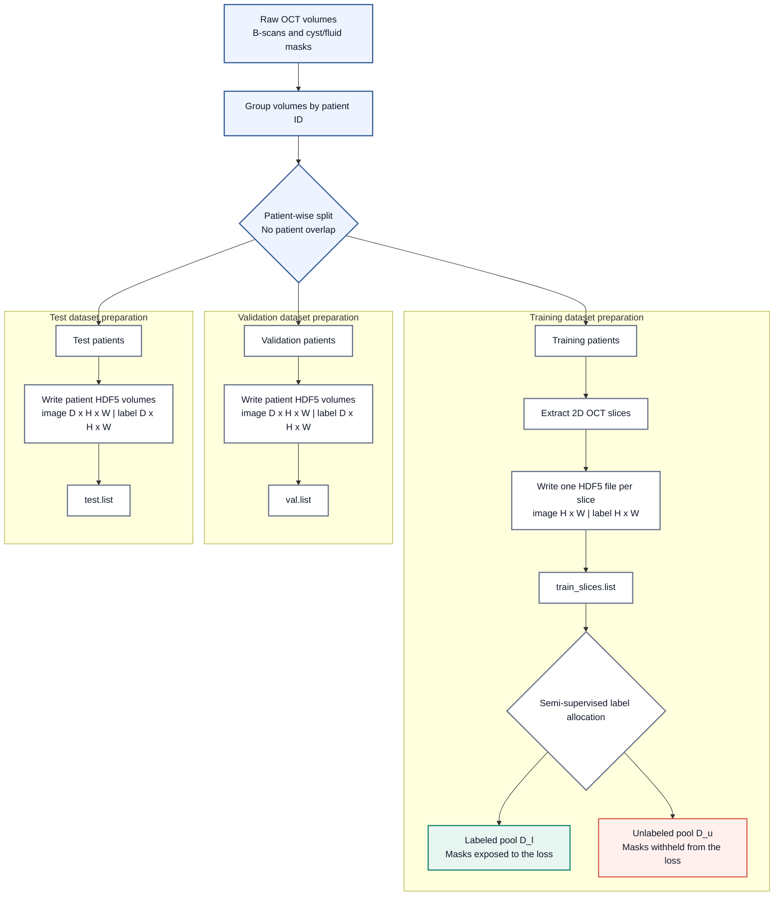
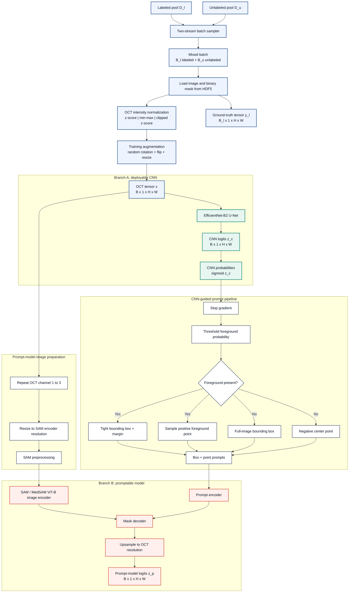
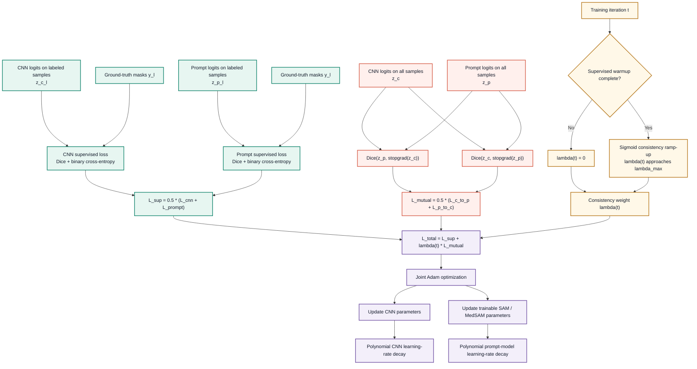
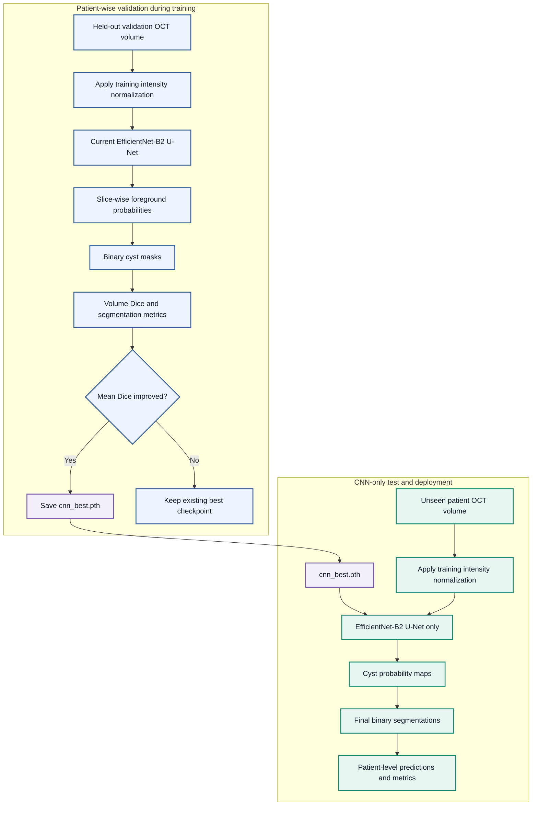

# SemiSAM System Architecture

## End-to-End Data and Learning Pipeline

SemiSAM couples a deployable convolutional segmentation network with a promptable foundation model during training. The architecture is organized into four stages: patient-wise cohort construction, dual-branch forward propagation, semi-supervised mutual optimization, and CNN-only evaluation.

### 1. Patient-Wise Cohort Construction

*Figure 1. Patient-level partitioning is performed before slice extraction. This prevents correlated B-scans from the same patient appearing across training, validation, and test cohorts.*

### 2. Dual-Branch Forward Propagation

*Figure 2. The CNN processes every OCT B-scan and produces the mask used to derive a detached box-point prompt. The same image and generated prompt condition SAM or MedSAM, producing a second segmentation at the original OCT resolution.*

### 3. Semi-Supervised Mutual-Learning Objective

*Figure 3. Ground-truth supervision is restricted to the labeled subset, whereas bidirectional consistency is evaluated over the complete mixed batch. Stop-gradient targets isolate the learning direction of each consistency term.*

### 4. Patient-Wise Validation and CNN-Only Inference

*Figure 4. Model selection uses held-out patient volumes and CNN Dice performance. The promptable branch is a training-time collaborator only; deployment requires the normalized OCT input and the selected CNN checkpoint.*
